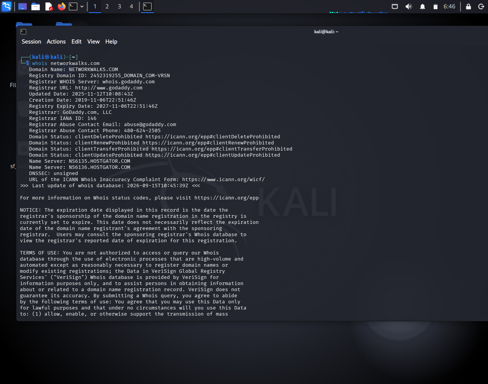
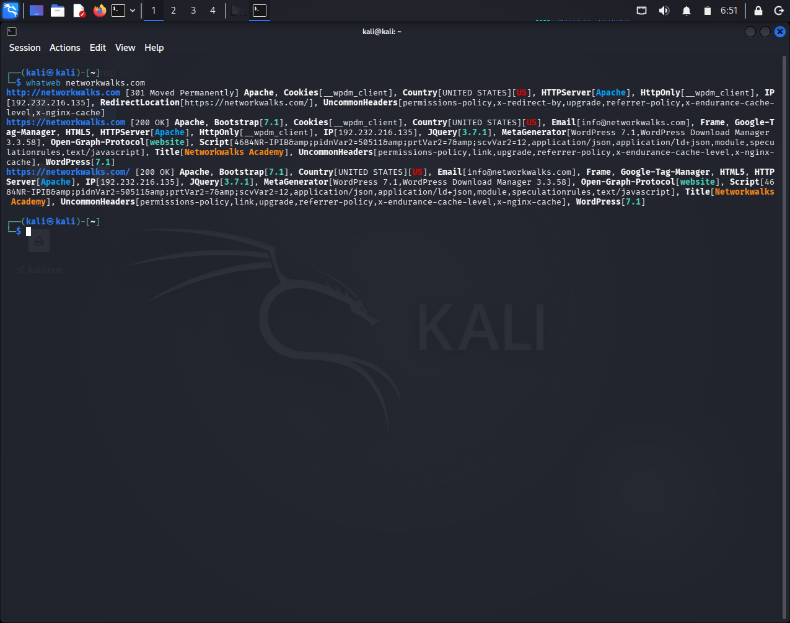
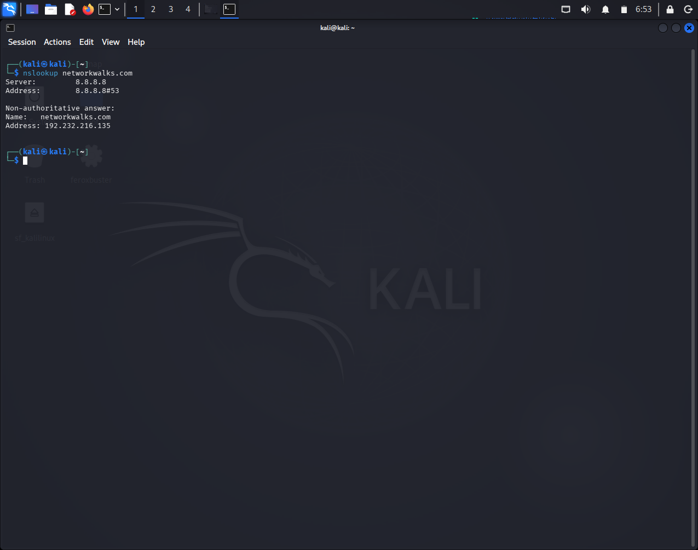
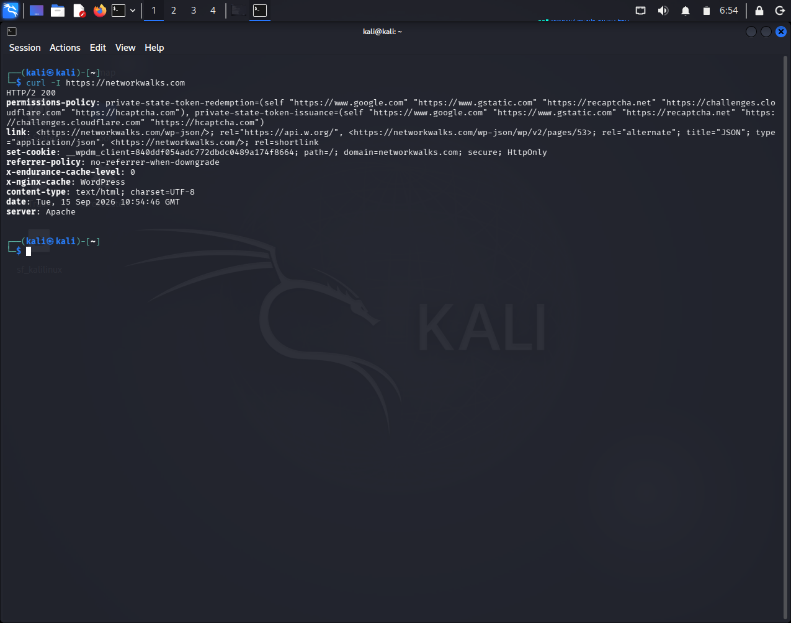
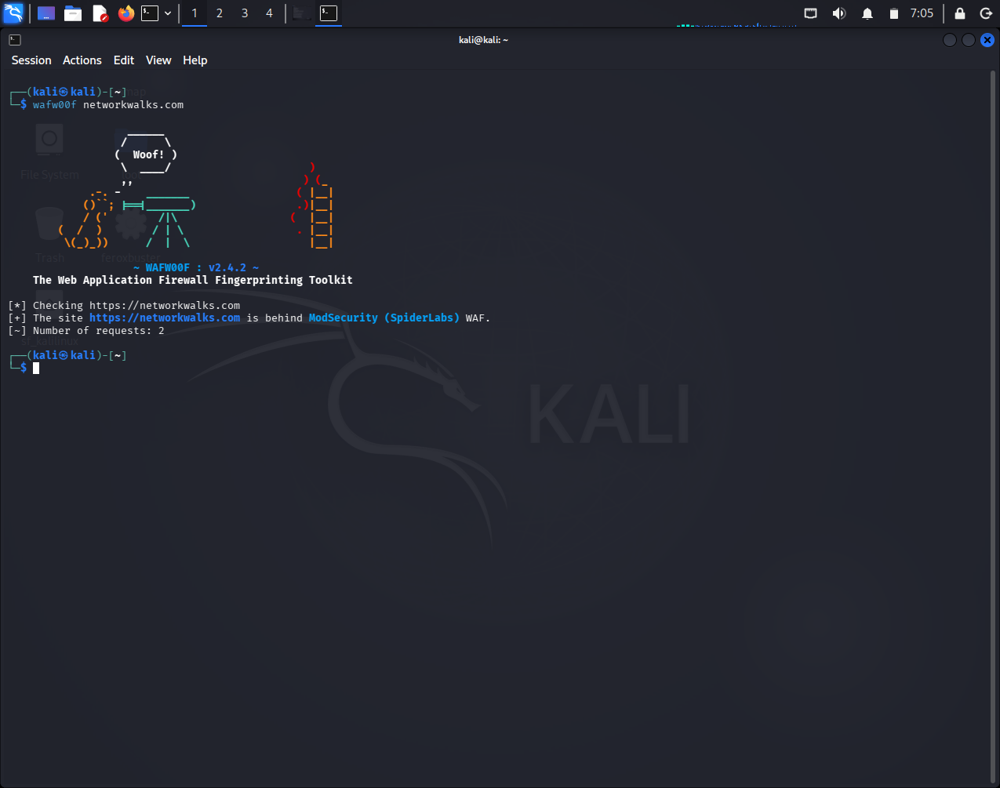
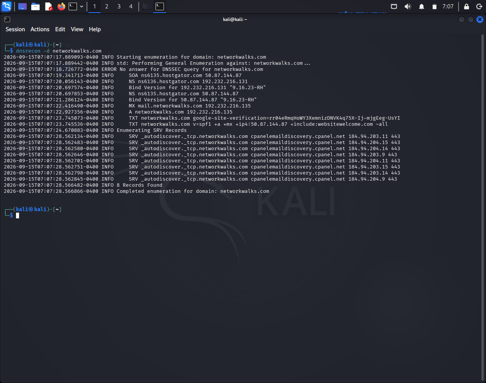
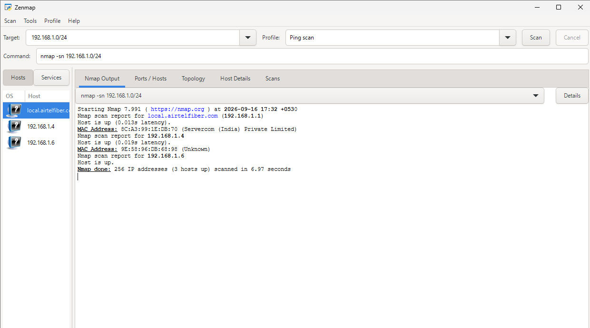
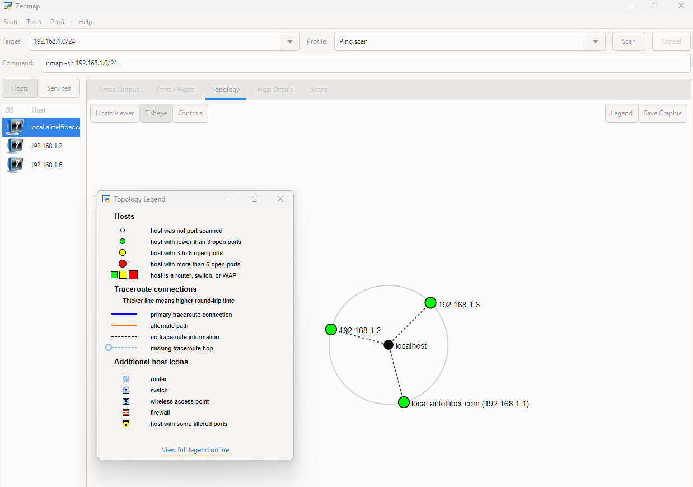

# NETWORKWALKS-B083-WK2-PENETRATION-TESTING-REPORT


This assessment focused on basic penetration testing activities involving information gathering, reconnaissance, DNS enumeration, web technology identification, HTTP analysis, WAF detection, and local network scanning.


| Project Information    | Details                                |
| ---------------------- | -------------------------------------- |
| **Author**             | Debashree Sinha                        |
| **Program / Batch**    | B083-Networkwalks                      |
| **Date**               | 17 September 2026                      |
| **Modules Completed**  | W2-PM1 — Multiple Kali Tools           |
|                        | W2-PM5 — Network Scanning with Zenmap  |
| **Client / Target**    | Networkwalks (`networkwalks.com`)      |
| **Additional Target**  | Own Local LAN Network                  |
| **Permission Secured** | Yes                                    |
| **Phases Covered**     | Phase 1: Reconnaissance & Footprinting |
|                        | Phase 2: Scanning & Network Discovery  |
| **Current Status**     | Phases 3–5: In Progress                |

---

## Table of Contents

1. [Liability Disclaimer](#1-liability-disclaimer)
2. [Introduction](#2-introduction)
3. [Tools Used](#3-tools-used)
4. [Activities Performed](#4-activities-performed)

   * [4.1 Footprinting & Reconnaissance](#41-footprinting--reconnaissance)
   * [4.2 Network Scanning with Zenmap](#42-network-scanning-with-zenmap)
5. [Risk Analysis / Impact](#5-risk-analysis--impact)
6. [Recommendations](#6-recommendations)
7. [Conclusion](#7-conclusion)
8. [Evidences Collected](#8-evidences-collected)

---

# 1. Liability Disclaimer

I performed the activities documented in this report only within an authorized scope, including the assigned Networkwalks target and my own local network.

The purpose of these exercises is cybersecurity education and practical learning. The tools and techniques described in this report should only be used on systems and networks where appropriate authorization has been obtained.

Unauthorized access, scanning, or testing may have legal and security consequences, and the responsibility for any misuse rests with the person performing the activity.

---

# 2. Introduction

This report presents the practical work completed during my cybersecurity internship at Networkwalks. The activities focused on two important stages of a security assessment: footprinting and reconnaissance of the authorized `networkwalks.com` domain, followed by network discovery of my own local LAN using Zenmap.

For the reconnaissance activity, I used several Kali Linux tools to collect publicly available information about the domain, its web technologies, DNS configuration, HTTP responses, and WAF presence.

For the network-scanning activity, I used Windows network commands and Zenmap to identify active devices within my local network.

The purpose of these exercises was not to exploit any system, but to understand how much information can be gathered during the early stages of a security assessment and how that information can be documented for further security analysis.

---

# 3. Tools Used

| Tool                     | Purpose                                                                     |
| ------------------------ | --------------------------------------------------------------------------- |
| **Kali Linux & Windows** | Platforms used for the footprinting and network-discovery activities.       |
| **WHOIS**                | Collect publicly available domain registration and name-server information. |
| **WhatWeb**              | Identify technologies and web components exposed by the target website.     |
| **Nslookup**             | Resolve the domain name and obtain DNS-related address information.         |
| **Curl -I**              | Inspect HTTP response headers returned by the website.                      |
| **Wafw00f**              | Check whether a Web Application Firewall can be identified.                 |
| **DNSRecon**             | Collect available DNS records and related infrastructure details.           |
| **Zenmap (Nmap GUI)**    | Scan the local subnet to find live hosts, IPs and MAC addresses.            |
| **Windows CMD**          | Check local network configuration and identify IP/MAC information.          |

---

# 4. Activities Performed

## 4.1 Footprinting & Reconnaissance

I started the practical by performing reconnaissance on the authorized `networkwalks.com` domain. Six Kali Linux tools were used, with each tool providing a different type of information about the target.

### WHOIS

The WHOIS lookup identified the domain registrar, registration dates, nameservers, and privacy-protected registrant information.

| Information    | Result                                       |
| -------------- | -------------------------------------------- |
| **Domain**     | `networkwalks.com`                           |
| **Registrar**  | GoDaddy.com, LLC                             |
| **Created**    | 06 November 2019                             |
| **Expiry**     | 06 November 2027                             |
| **DNSSEC**     | Unsigned                                     |
| **Registrant** | Registration Private / Domains By Proxy, LLC |

---

### WhatWeb

WhatWeb identified the following technologies:

* Apache
* WordPress 7.1
* WordPress Download Manager 3.3.58
* Bootstrap 7.1
* jQuery 3.7.1

The website resolved to:

```text
192.232.216.135
```

---

### Nslookup

The domain resolved to:

```text
networkwalks.com → 192.232.216.135
```

---

### Curl -I

The HTTP headers showed:

* HTTP/2 200 response
* Apache server
* WordPress-related headers
* WordPress REST API paths
* Secure and HttpOnly cookie attributes

---

### Wafw00f

Wafw00f detected:

```text
ModSecurity (SpiderLabs)
```

as the WAF protecting the website.

---

### DNSRecon

DNS enumeration identified:

* SOA and NS records
* A record: `192.232.216.135`
* MX record: `mail.networkwalks.com`
* TXT/SPF records
* Multiple mail-related SRV records
* DNSSEC query returned no answer

---

## 4.2 Network Scanning with Zenmap

The second part of the practical involved discovering active devices on my own local network using Zenmap.

I first used Windows network configuration information to identify my local IPv4 address, subnet mask, and network range.

### Network Configuration

| Parameter       | Value            |
| --------------- | ---------------- |
| **Local IP**    | `192.168.1.6`    |
| **Subnet Mask** | `255.255.255.0`  |
| **Network**     | `192.168.1.0/24` |

I then performed a Ping Scan in Zenmap against the `192.168.1.0/24` network.

The scan reported:

```text
256 IP addresses (3 hosts up).
```

### Detected Hosts

| IP Address    | MAC Address         |
| ------------- | ------------------- |
| `192.168.1.1` | `8C:A3:99:1E:DB:70` |
| `192.168.1.2` | `02:F3:C9:08:2C:D5` |
| `192.168.1.6` | Not displayed       |

For `192.168.1.1`, Zenmap associated the MAC address with **Servercom (India) Private Limited**.

The MAC address for `192.168.1.2` was detected, but its vendor was listed as **Unknown**.

The host at `192.168.1.6` was identified as my own Windows PC. Zenmap did not display a MAC address for this host in the scan results, so the corresponding MAC information can be taken from the Windows `ipconfig /all` output if required.

The topology view in Zenmap was also used to visualize the discovered network devices.

---

# 5. Risk Analysis / Impact

Based on the information collected during the footprinting and network scanning activities, the following potential risks were identified.

| # | Risk / Finding                                   | Evidence / Observation                                                                             | Potential Impact                                                                                           | Risk Level |
| - | ------------------------------------------------ | -------------------------------------------------------------------------------------------------- | ---------------------------------------------------------------------------------------------------------- | ---------- |
| 1 | **Web technology information exposed**           | WhatWeb identified Apache, WordPress 7.1, WordPress Download Manager 3.3.58, Bootstrap and jQuery. | Technology and version information may help an attacker identify components for further security research. | **Medium** |
| 2 | **Server IP address identifiable**               | Nslookup resolved `networkwalks.com` to `192.232.216.135`.                                         | Reveals the IP address associated with the public-facing domain.                                           | **Low**    |
| 3 | **HTTP technical information exposed**           | Curl identified Apache, WordPress-related headers and the `/wp-json/` REST API endpoint.           | May assist further fingerprinting and enumeration of the web application.                                  | **Low**    |
| 4 | **WAF technology identifiable**                  | Wafw00f identified ModSecurity (SpiderLabs).                                                       | Provides information about part of the website's defensive architecture.                                   | **Low**    |
| 5 | **DNS infrastructure information exposed**       | DNSRecon identified SOA, NS, MX, A, TXT and SRV records.                                           | DNS information can help create a broader map of the organization's external infrastructure.               | **Medium** |
| 6 | **Multiple live hosts visible on local network** | Zenmap identified 3 active hosts within `192.168.1.0/24`.                                          | Unexpected devices on a local network may require identification and verification.                         | **Medium** |


These are security observations rather than confirmed vulnerabilities. The exercises focused on reconnaissance and network discovery, and no exploitation or vulnerability validation was performed.

Therefore, the presence of a technology version, IP address, DNS record, or live host does not by itself establish that the system is vulnerable.

---

# 6. Recommendations

Based on the observations from these activities, the following security improvements are recommended.

### 1. Review Publicly Exposed Technologies

Regularly review the information that can be obtained through tools such as WhatWeb and minimize unnecessary disclosure of technology and version information.

### 2. Keep Web Technologies Updated

WordPress, plugins, libraries, and other web components should be maintained and checked against relevant security advisories.

### 3. Review HTTP Response Headers

HTTP headers should be periodically reviewed to determine whether unnecessary technical information or endpoints are being exposed.

### 4. Monitor DNS Records

DNS records should be reviewed regularly to ensure that only required services and information are publicly available.

### 5. Maintain the WAF

The detected ModSecurity WAF should remain properly configured, maintained, and monitored as part of the website's security controls.

### 6. Perform Regular Network Discovery

Authorized internal scans can help identify which devices are currently connected to the network.

### 7. Verify Unfamiliar Devices

Devices such as the host at `192.168.1.2` should be identifiable and associated with a legitimate device or user within the network.

### 8. Maintain Accurate Network Documentation

IP addresses, devices, network ranges, and topology information should be kept updated to make unexpected changes easier to detect.

### 9. Keep Reconnaissance Within an Authorized Scope

Footprinting and scanning should only be conducted against systems and networks where appropriate permission has been obtained.

---

# 7. Conclusion

During my cybersecurity internship at Networkwalks, I completed practical exercises covering domain footprinting, reconnaissance, and local network scanning.

The footprinting activity provided hands-on experience with WHOIS, WhatWeb, Nslookup, Curl, Wafw00f, and DNSRecon. Each tool provided a different perspective of the target, ranging from domain registration and DNS information to web technologies, HTTP headers, and WAF detection.

The results showed that publicly accessible information can reveal considerable details about a web environment. The reconnaissance identified the domain's IP address, WordPress and related technologies, DNS records, mail infrastructure, and the presence of ModSecurity.

The Zenmap exercise allowed me to apply the same information-gathering concept to a local network. I identified the `192.168.1.0/24` subnet and discovered three active hosts, including the router, another detected device, and my own Windows PC.

A key takeaway from these exercises is that reconnaissance is an important early stage of cybersecurity assessment. Understanding what information is visible and which devices are active can help security professionals build an accurate picture of an environment before deeper testing is considered.

I also gained experience in documenting technical findings in a structured way, including the tool used, evidence collected, observation, possible impact, and recommended security measures. Most importantly, these activities reinforced that scanning and reconnaissance should always be performed within an authorized scope.

---

# 8. Evidences Collected

The repository contains screenshots and evidence collected during the assessment.


### Whois


### WhatWeb


### Nslookup


### Curl


### Wafw00f


### DNSRecon


### Zenmap




> Evidence images are available in the [`Evidences`](./Evidences/) folder.

---

## Author

### Debashree Sinha

**Cybersecurity Learner | Building Strong Foundations in Networking, Linux & Python**

[LinkedIn](https://www.linkedin.com/in/debashrees)

---

## Project Information

|             |                                       |
| ----------- | ------------------------------------- |
| **Program** | NetworkWalks Cybersecurity Internship |
| **Week**    | 02                                    |
| **Project** | W2-PM1 — Multiple Kali Tools          |
| **Project** | W2-PM5 — Network Scanning with Zenmap |
| **Focus**   | Footprinting & Network Scanning       |

---

### Disclaimer

This repository is intended for educational and documentation purposes. The techniques demonstrated should only be used against systems and networks for which proper authorization has been obtained.
